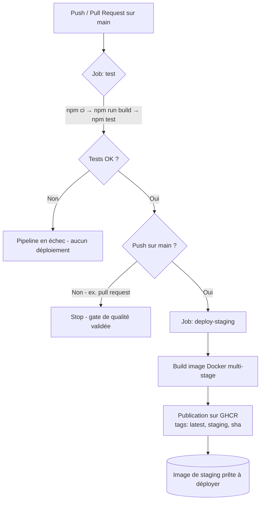

# GitHub Actions : Mise en place d'un Pipeline CI/CD Minimaliste


## Objectif

Configurer un **workflow CI/CD avec GitHub Actions** pour :

1. l'**exécution automatique des tests unitaires** à chaque modification du code (push ou pull request) ;
2. le **déploiement continu vers un environnement de staging**, sous la forme d'une image Docker publiée automatiquement sur GHCR à chaque push sur `main`.

Le cœur de ce dépôt est donc le **pipeline** (`.github/workflows/ci-cd.yml`). L'application
qui l'accompagne, une petite API `text-utils` (Node + TypeScript + Express), n'est qu'un
**support réaliste** : elle est volontairement minimale mais réellement testable et conteneurisable.

## Le pipeline en un schéma



Principe clé : le job `deploy-staging` déclare `needs: test`. La construction et la
publication de l'image **ne peuvent donc jamais avoir lieu si les tests échouent** :
les tests forment un *gate* (une barrière de qualité) avant tout déploiement.

## Structure du dépôt

```text
ci-cd-minimaliste/
├── .github/
│   └── workflows/
│       └── ci-cd.yml          # ⭐ Le pipeline CI/CD (pièce maîtresse)
├── src/
│   ├── lib/
│   │   ├── text.ts            # Fonctions pures : slugify, wordCount, truncate, titleCase
│   │   └── text.test.ts       # Tests unitaires (Vitest)
│   ├── app.ts                 # Application Express (exportée, sans démarrage serveur)
│   ├── app.test.ts            # Tests d'intégration des endpoints (Vitest + supertest)
│   └── server.ts              # Démarrage du serveur HTTP
├── Dockerfile                 # Build multi-stage, image runtime non-root
├── .dockerignore
├── .gitignore
├── .env.example               # Variable PORT
├── tsconfig.json              # Configuration TypeScript (mode strict)
├── vitest.config.ts           # Configuration des tests
├── package.json
├── LICENSE                    # MIT
└── README.md
```

## L'application support : `text-utils`

Une mini-API Express exposant des fonctions de manipulation de texte.

| Méthode | Route                    | Description                                   |
| ------- | ------------------------ | --------------------------------------------- |
| `GET`   | `/`                      | Informations et version de l'API              |
| `GET`   | `/health`                | Sonde de santé → `{ "status": "ok" }`         |
| `GET`   | `/api/slugify?text=...`  | Transforme le texte en slug d'URL             |
| `GET`   | `/api/wordcount?text=...`| Compte le nombre de mots                       |

Les fonctions métier (`src/lib/text.ts`) sont **pures** (sans effet de bord), ce qui les
rend faciles à tester unitairement.

## Démarrage local

Prérequis : **Node.js 20+**.

```bash
# 1. Installer les dépendances
npm install

# 2. Lancer les tests (unitaires + intégration)
npm test

# 3. Démarrer l'API en mode développement (rechargement à chaud)
npm run dev
```

L'API écoute par défaut sur `http://localhost:3000` (modifiable via la variable `PORT`).

Exemples de requêtes :

```bash
curl http://localhost:3000/health
# {"status":"ok"}

curl "http://localhost:3000/api/slugify?text=Bonjour%20le%20Monde%20!"
# {"input":"Bonjour le Monde !","slug":"bonjour-le-monde"}

curl "http://localhost:3000/api/wordcount?text=un%20deux%20trois"
# {"input":"un deux trois","count":3}
```

Autres scripts disponibles :

```bash
npm run build      # Compile TypeScript vers dist/
npm start          # Démarre l'application compilée (dist/server.js)
npm run test:watch # Tests en mode surveillance
```

## Exécution via Docker

L'image de staging est publiée automatiquement par le pipeline sur **GHCR**. Le nom de
l'image suit le propriétaire du dépôt **en minuscules** (`moutacdie2000`), c'est une
contrainte de GHCR, d'où l'étape du workflow qui met le propriétaire en minuscules.

```bash
# Récupérer et lancer la dernière image de staging publiée
docker run --rm -p 3000:3000 ghcr.io/moutacdie2000/ci-cd-minimaliste:staging
```

Construction locale de l'image (optionnel) :

```bash
docker build -t ci-cd-minimaliste:local .
docker run --rm -p 3000:3000 ci-cd-minimaliste:local
```

Le `Dockerfile` est **multi-stage** : une première étape compile le TypeScript, la seconde
ne conserve que les artefacts de production et s'exécute sous un **utilisateur non-root**.

## Explication détaillée du pipeline

Le workflow `.github/workflows/ci-cd.yml` se compose de **deux jobs**.

### Job `test`, intégration continue (CI)

Déclenché à chaque `push` sur `main` **et** à chaque `pull_request` ciblant `main`. Étapes :

1. `actions/checkout`, récupération du code ;
2. `actions/setup-node` (Node 20, cache npm activé), environnement d'exécution ;
3. `npm ci`, installation reproductible des dépendances ;
4. `npm run build`, compilation TypeScript (échoue si erreur de typage) ;
5. `npm test`, exécution de **tous** les tests Vitest.

### Job `deploy-staging`, déploiement continu (CD)

- `needs: test` : ne s'exécute que si le job `test` a **réussi** (gate de qualité).
- `if: github.event_name == 'push' && github.ref == 'refs/heads/main'` : ne se déclenche
  **que** sur un push vers `main` (donc jamais sur une simple pull request).
- `environment: staging` : rattache l'exécution à l'environnement GitHub « staging »
  (traçabilité des déploiements, possibilité d'ajouter des règles de protection).
- Permissions : `contents: read` et `packages: write` (écriture sur GHCR).

Étapes :

1. `checkout` du code ;
2. calcul du **propriétaire en minuscules** (`${{ github.repository_owner }}` → minuscules),
   requis par GHCR ;
3. `docker/setup-buildx-action`, moteur de build avancé + cache ;
4. `docker/login-action`, connexion à `ghcr.io` avec l'utilisateur `${{ github.actor }}`
   et le jeton intégré `${{ secrets.GITHUB_TOKEN }}` ;
5. `docker/build-push-action`, construction et **publication** de l'image avec trois tags :
   - `:latest`, dernière image en date,
   - `:staging`, image de l'environnement de staging,
   - `:<github.sha>`, image immuable tracée par commit.

> **Aucune clé secrète externe n'est requise.** Le jeton `GITHUB_TOKEN` fourni
> automatiquement par GitHub Actions suffit pour publier sur GHCR.

C'est précisément le « déploiement continu vers le staging » demandé : à chaque push sur
`main` qui passe les tests, une image de staging à jour est publiée et **prête à être
déployée** sur n'importe quel hébergeur compatible Docker.

## Ce que ce projet démontre

- La mise en place d'un **pipeline CI/CD** complet et fonctionnel avec **GitHub Actions**.
- L'**automatisation des tests** (unitaires + intégration) comme barrière de qualité.
- L'enchaînement conditionnel de jobs (`needs`, `if`) : un déploiement n'a lieu que sur la
  bonne branche, et seulement si la CI est verte.
- La **conteneurisation** (Dockerfile multi-stage, image non-root) et la **publication
  d'artefacts** sur un registre (GHCR) à l'aide du seul `GITHUB_TOKEN`.
- De bonnes pratiques applicatives : TypeScript strict, fonctions pures testables,
  séparation app / serveur.

## Licence

Distribué sous licence **MIT**. Voir le fichier [LICENSE](./LICENSE).

© 2026 Noumabeu Moutacdie Jordan
